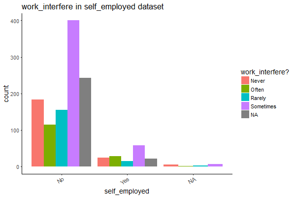

# Findings:

## Comfort With Supervisor vs. Mental Health Consequences

We found this visualization especially telling. This bar graph shows a correlation between  willingness to discuss a mental health issue with one's direct supervisor(s) and that individuals mental health consequences.

### Relationship between self-employment and work Interference

This visualization provides insight regarding the relationship between self-employment and work interference. The bar chart shows that their is a correlation between increased work interference and being self-employed. Those who were self-employed were more prone to their mental issues interfering with their work.  
