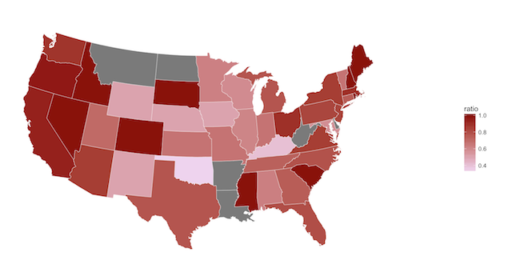
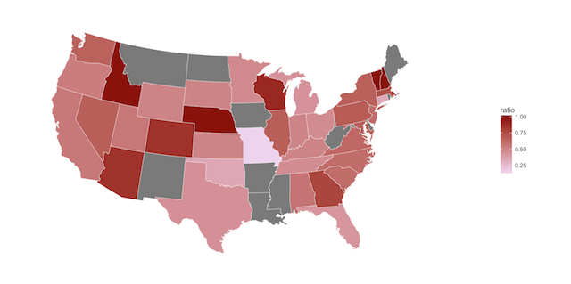

# Findings:

### Comfort With Supervisor vs. Mental Health Consequences

We found this visualization especially telling. This bar graph shows a correlation between  willingness to discuss a mental health issue with one's direct supervisor(s) and that individuals mental health consequences.
***
### Relationship between self-employment and work Interference

This visualization provides insight regarding the relationship between self-employment and work interference. The bar chart shows that their is a correlation between increased work interference and being self-employed. Those who were self-employed were more prone to their mental issues interfering with their work.  
***
### Tech Industry Employees vs. Care Options Provided

#### Ratio between those who work in tech, and those who do not:

#### Ratio between those with care options to those without:

In previous observations, we've already seen that individuals who work in the technology industry have a higher chance of experiencing mental health consequences than the national average. The high number of individuals working in tech is represented by the first map, where we can see that the majority of responders work in tech, especially along the coasts.

However, when we observe the ratio between those with care options to those without, it is obvious that care options are not appropriately provided in these areas. Some states that have a high risk of having a large population with mental health consequences and no care options include Washington, Oregon, California, Maine, South Dakota, and South Carolina.
