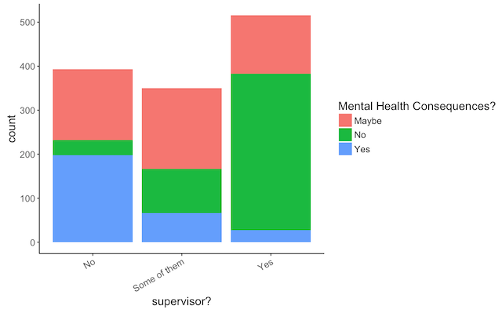

# Findings:

## Comfort With Supervisor vs. Mental Health Consequences

We found this visualization especially telling. This bar graph shows a correlation between  willingness to discuss a mental health issue with one's direct supervisor(s) and that individuals mental health consequences.
