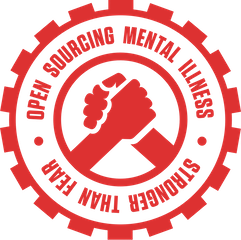

# Introduction: 

## Data

The data we are working with is Mental Health in Tech industry. This data was collected by Open Sourcing Mental Illness, LTD, and aims to measure attitude, frequency and disorders within the workplace. This is an ongoing survey since 2016.

Dataset: https://www.kaggle.com/osmi/mental-health-in-tech-survey

## Audience

The target audience are people in tech industries who want to understand the trend of mental health and see how the majority of the people are handling mental illness. This data is also helpful for those who are looking to transition into the tech industry by making sure that it is the right environment for them.

## Questions

* How many people are willing to discuss mental health issues with their direct supervisor?
* Does age, gender, or state affect their willingness to discuss?
* Does their employer provide resources to learn more about mental health issues and how to seek help?
* Does your employer provide mental health benefits?
* How many people took the survey?

## Tools

* ggplot2
* dplyr
* Microsoft Text Analytics
* Shiny
* R

## Major challenges

One major challenge we anticipate is cleaning long answer data and trying to present it in a nice manner that can be easily understood.
Finding keywords will also be a challenge. What keywords should we use? How will we know that those keywords accurately represent the questions we’re asking?
